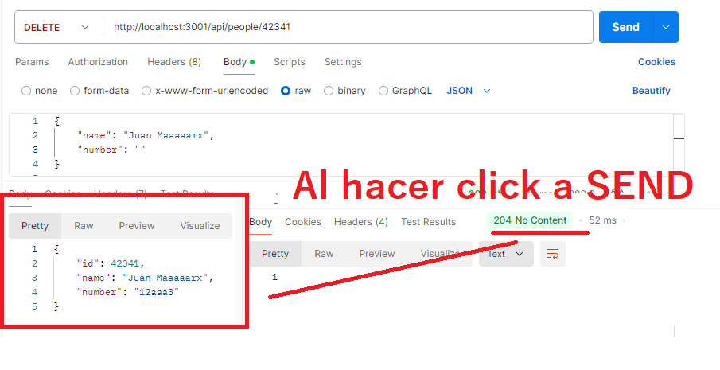

# Agenda Telefónica API - Sprint 7 Make It Real

Esta es una aplicación de servidor construida con Node.js y Express que proporciona una API para gestionar una agenda telefónica.

## Descripción

La API permite realizar las siguientes operaciones:

- Obtener la lista de contactos
- Obtener información sobre la agenda
- Obtener un contacto específico por ID
- Eliminar un contacto
- Agregar nuevos contactos

## Endpoints

### 1. Obtener todos los contactos

**Método:** `GET`  
**Ruta:** `/api/people`  
**Respuesta:**

```json
[
  { "id": 1, "name": "Arto Hellas", "number": "040-123456" },
  { "id": 2, "name": "Ada Lovelace", "number": "39-44-5323523" }
]
```

### 2. Obtener información sobre la agenda

**Método:** `GET`  
**Ruta:** `/info`  
**Respuesta:**

```
Agenda telefónica tiene 4 entradas.
Thu Oct 10 2024 19:32:38 GMT-0500 (hora estándar de Perú)
```

### 3. Obtener un contacto específico

**Método:** `GET`  
**Ruta:** `/api/people/:id`  
**Respuesta (Si existe):**

```json
{ "id": 1, "name": "Arto Hellas", "number": "040-123456" }
```

**Respuesta (Si NO existe):**

```json
{ "error": "Persona no encontrada" }
```

### 4. Eliminar un contacto

**Método:** `DELETE`  
**Ruta:** `/api/people/:id`  
**Respuesta: 204 No Content**

### 5. Agregar un nuevo contacto

**Método:** `POST`  
**Ruta:** `/api/people`  
**Cuerpo de la solicitud (Body en formato json):**

```json
{ "name": "Nuevo Nombre", "number": "123-456789" }
```

**Respuesta (si se agrega correctamente):**

```json
{ "id": 5, "name": "Nuevo Nombre", "number": "123-456789" }
```

**Respuesta (si falta nombre o número):**

```json
{ "error": "Falta el nombre o el número" }
```

**Respuesta (si el nombre ya existe):**

```json
{ "error": "El nombre ya existe en la agenda" }
```

## Cómo ejecutar la aplicación

### 1. Clona el repositorio:

```
git clone <https://github.com/Mikelyto1994/Agenda-Telefonica-MIR>
```

### 2. Instala las dependencias:

Donde haya clonado la carpeta, abre la terminal y navega hasta ahi para luego instalar las dependencias:

```
npm install
```

### 3. Compila el TypeScript:

```
npm run build
```

### 4. Inicia el servidor:

```
npm start
```

### 5. Para desarrollo (reinicia automáticamente el servidor en cambios):

```
npm run dev
```

## Dependencias

- Express: Framework web para Node.js.
- Morgan: Middleware para registrar solicitudes HTTP.
- TypeScript: Lenguaje de programación que compila a JavaScript.

## Notas

- Asegúrate de tener Node.js y npm instalados en tu máquina.
- Puedes probar los endpoints utilizando Postman o cualquier cliente HTTP.

## Pantallazos de Postman

Se muestran algunos pantallazos de las funciones que se hace:

Ya enviado el post de un nuevo contacto telefonico:


Cuando falta el nombre o numero, o cuando se repite el Post no se va a ejecutar y saldra errores:


Cuando se elimina este nuevo contacto, el delete da un mensaje final 204 diciendo que no se encuentra el contenido:


## Contribuciones

Si deseas contribuir, siéntete libre de hacer un fork del repositorio y enviar un pull request.

Puedes copiar este texto y pegarlo en tu archivo `README.md`. ¡No olvides agregar los pantallazos que mencionaste!
